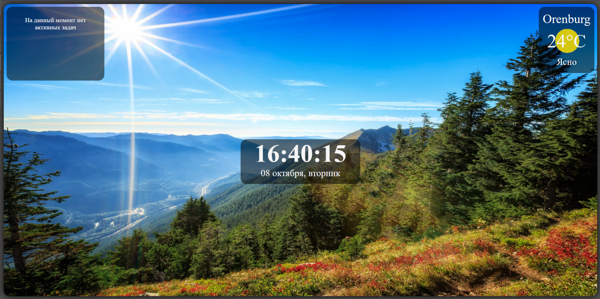

# traineeship-test-task_momentum

traineeship-test-task_momentum - это тестовое задание для стажировки в компании DIGITAL SECTOR. Для выполнения данной задачи необходимо реализовать веб-приложение momentum, аналог расширения. В приложении есть часы, дата, слайдер изображений, виджеты погоды, список задач.



Посмотреть готовую работу можно на gp-pages по этой [ссылке](https://georgemikheev.github.io/traineeship-test-task_momentum/).
___
## Update V-1.1:

- Дизайн приложения оптимизирован под мобильные устройства;

___

## Инструкция по установки:

Для начала клонируйте данный репозиторий в свою директорию командой 'git clone'.

```
git clone git@github.com:GeorgeMikheev/traineeship-test-task_momentum.git
```

После чего перейдите по [ссылке](https://www.weatherbit.io/api/weather-current) и зарегистрируйтесь на данном сайте, что бы получить ключ.

Дальше нужно открыть проект в любом редакторе кода и в корневой папки создать файл '.env' и создать там переменную 'WTHR_API_KEY=' в значение которой записать ваш ключ.

```
WTHR_API_KEY=
```

Установите все зависимости:

```
npm i
```

И запустите проект:

```
npm run dev
```
___

## Стек технологий:

<p align="center">
<a href="https://developer.mozilla.org/en-US/docs/Web/JavaScript" target="_blank" rel="noreferrer"></a><a href="https://code.visualstudio.com/" target="_blank" rel="noreferrer"></a><a href="https://developer.mozilla.org/en-US/docs/Glossary/HTML5" target="_blank" rel="noreferrer"></a><a href="https://www.w3.org/TR/CSS/#css" target="_blank" rel="noreferrer"></a><a href="https://webpack.js.org/" target="_blank" rel="noreferrer"></a><a href="https://babeljs.io/" target="_blank" rel="noreferrer"></a>
</p>
